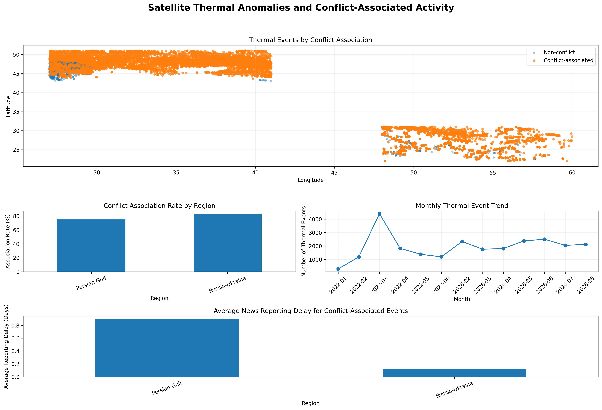

# Satellite-Based Conflict Monitoring for Maritime Shipping

### Integrating NASA FIRMS Thermal Anomalies, Conflict-Related News, Geospatial Analysis and Machine Learning

A data science project combining **NASA FIRMS satellite thermal anomalies** with **conflict-related news** to investigate whether thermal events can support conflict situation monitoring in regions relevant to maritime shipping and energy markets.

The project compares two strategically important case studies — the **Persian Gulf / Strait of Hormuz** and **Russia–Ukraine / Black Sea** — and integrates satellite data, news data, geospatial analysis, statistical testing, PostgreSQL, Docker, and machine learning classification into one reproducible analytical pipeline.

---

## Core Research Question

> **Can satellite-detected thermal anomalies, when correlated with conflict-related news, serve as indicators of armed conflict activity in regions that matter to global shipping and energy markets?**

The project approaches this question by combining independent satellite observations with contextual information from conflict-related news. Thermal anomalies are therefore treated as **supporting signals**, not as direct evidence of armed conflict.

---

## Project Workflow

The project follows an end-to-end data science pipeline, from satellite and news data collection to database storage, analysis, machine learning, and decision-support insights.

```text
NASA FIRMS API ──────┐
                     │
Conflict News ───────┤
                     ▼
              Data Processing
                     │
                     ▼
            PostgreSQL / Docker
                     │
                     ▼
        Spatial & Temporal Analysis
                     │
            ┌────────┴────────┐
            ▼                 ▼
     News Matching      Statistical Analysis
            │
            ▼
      ML Classification
            │
            ▼
          Dashboard
            │
            ▼
 Shipping & Energy Risk Insights
```

---

## Key Results

| Result | Persian Gulf | Russia–Ukraine |
|---|---:|---:|
| Thermal events | 14,995 | 10,315 |
| Conflict-associated events | 11,276 | 8,582 |
| Association rate | **75.2%** | **83.2%** |
| Day detections | 17.87% | 69.42% |
| Night detections | 82.13% | 30.58% |

The regional comparison revealed clear differences. The Russia–Ukraine case study showed a higher conflict-association rate, while the two regions also displayed substantially different day/night detection patterns.

> **Important:** The association rate is **not** the accuracy of satellite-based conflict detection. It represents the proportion of thermal events that could be associated with conflict-related news using the project's temporal, spatial, and keyword-based matching methodology.

### News Coverage

| Metric | Persian Gulf | Russia–Ukraine |
|---|---:|---:|
| News articles | 27,188 | 21,050 |
| Unique sources | 73 | 215 |
| Average matched articles per event | 28.83 | 56.68 |
| Average reporting delay | 0.90 days | 0.13 days |

### Statistical Test

A Mann–Whitney U test compared total FRP for conflict-associated and non-conflict events.

- Conflict-associated median FRP: **5.94**
- Non-conflict median FRP: **6.29**
- p-value: **0.0001**

The distributions differ statistically, but FRP alone should not be treated as a conflict detector.

---

## Machine Learning Results

The prediction task was formulated as a **binary classification problem**: whether a thermal event was conflict-associated (`1`) or not (`0`).

| Model | Accuracy | Precision | Recall | F1 |
|---|---:|---:|---:|---:|
| Logistic Regression | 0.822 | 0.864 | 0.917 | 0.890 |
| Decision Tree | **0.889** | **0.925** | **0.934** | **0.930** |

The Decision Tree achieved the stronger overall test-set performance in this experiment. Feature-importance analysis indicated that geographic and temporal context contributed substantially to the classification.

---

## Main Conclusion

> **Satellite thermal anomalies can provide useful supporting signals for conflict situation monitoring, but they cannot independently determine whether a thermal event was caused by armed conflict.**

Their analytical value increases when satellite observations are combined with **news reporting, geographic information, temporal context, and machine learning**.

The resulting system should therefore be interpreted as a **decision-support and early-warning framework**, rather than as an autonomous conflict detector.

For maritime shipping and energy risk management, this approach provides a foundation that could be extended with vessel tracking, port activity, infrastructure, weather, and market data.

---

## Data Sources

### NASA FIRMS

Satellite thermal anomaly data were collected from NASA FIRMS using the API in 5-day blocks.

- Persian Gulf: VIIRS S-NPP, February 1–August 31, 2026
- Russia–Ukraine: VIIRS S-NPP, January 1–June 30, 2022
- Cleaned FIRMS detections stored in PostgreSQL: **133,089**

### Conflict News

Three collection methods were used:

- Google News / GNews
- The Guardian Open Platform API
- Al Jazeera web scraping with Requests and BeautifulSoup

After combination and duplicate removal, **48,238 news records** were stored in PostgreSQL.

---

## Methodology

### 1. Data Collection and Cleaning

FIRMS data were downloaded through the API, parsed into Pandas DataFrames, cleaned, assigned to regions and checked for missing or anomalous values. News data were collected from multiple sources and standardized into a common structure.

### 2. NLP and Location Extraction

Article titles and snippets were processed with spaCy. Named Entity Recognition was used to identify geographical entities and create structured location information for matching.

### 3. Thermal Event Construction

Individual satellite detections were transformed into discrete thermal events. Event-level features include:

- centroid latitude and longitude
- start and end date
- duration
- total FRP
- maximum brightness
- detection count
- region

The final dataset contains **25,310 thermal events**.

### 4. PostgreSQL and Docker

PostgreSQL runs inside Docker and is used as the persistent storage layer. Python connects to PostgreSQL with SQLAlchemy. Processed data are stored in four tables:

- `firms_detections`
- `news_articles`
- `thermal_events`
- `event_matches`

Later analyses retrieve data with SQL queries through `pd.read_sql()`.

### 5. Thermal–News Matching

Thermal events were matched to conflict-related news using three dimensions:

- temporal proximity
- regional/location compatibility
- conflict-related keyword relevance

A thermal event is labelled:

- `1` = conflict-associated
- `0` = no conflict association found

### 6. Machine Learning Classification

This is a **classification problem**, not a regression problem.

The target is binary: `conflict_associated` = 1 or 0.

The project uses **Logistic Regression** and **Decision Tree** classifiers. Despite its name, Logistic Regression is a classification algorithm in this project.

Features include total FRP, duration, maximum brightness, detection count, centroid coordinates, region and month. The data were split 80/20 with stratification.

---

## Dashboard

The final `dashboard.png` is a static multi-panel analytical dashboard created with Matplotlib GridSpec. It summarizes the main spatial, regional, temporal, and reporting patterns in one figure.

The final dashboard is displayed below:



The dashboard serves as a compact analytical summary of the project rather than as an interactive application.

---

## Limitations

- FIRMS detects heat, not the cause of heat.
- Matching depends on time windows, locations and keywords.
- News coverage is uneven between regions.
- False positive and false negative matches remain possible.
- The two case studies cover different historical periods.
- Regional day/night differences can be affected by satellite observation conditions.
- Correlation does not establish causation.

---

## Future Work

Possible extensions include:

- AIS vessel movement data
- port and shipping-route data
- oil and gas infrastructure locations
- weather and wildfire datasets
- higher-resolution satellite imagery
- dedicated conflict-event databases
- improved geospatial matching
- transformer-based NLP and semantic matching
- interactive monitoring dashboard with scheduled data updates

---

## Project Structure

```text
maritime-conflict-situation-monitoring/
├── README.md
├── maritime_conflict_situation_monitoring.ipynb
├── requirements.txt
├── dashboard.png
├── thermal_events_map.png
├── russia_ukraine_thermal_events.png
└── persian_gulf_thermal_events.png
```

Large raw datasets, API keys, passwords, checkpoints, and local database volumes are not committed to GitHub.

---

## Reproducibility

1. Install Python dependencies from `requirements.txt`.
2. Start PostgreSQL with Docker.
3. Configure API credentials locally; do not commit secrets.
4. Run the Jupyter Notebook from top to bottom.
5. Verify that the four PostgreSQL tables are created.
6. Run the final dashboard section to generate `dashboard.png`.
